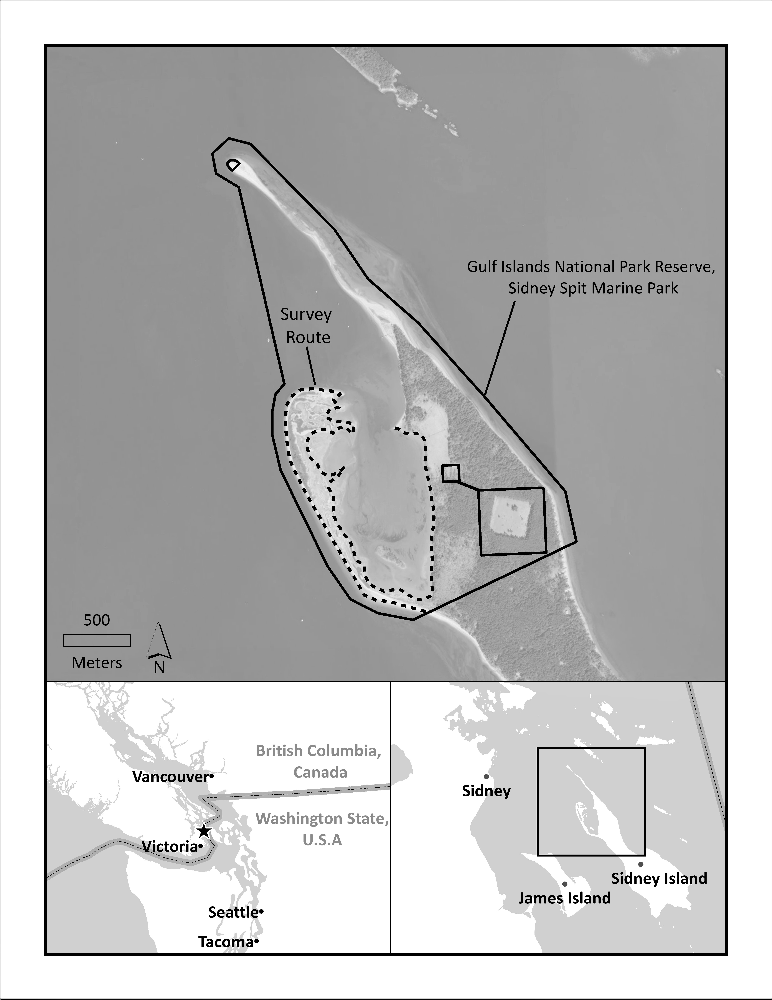
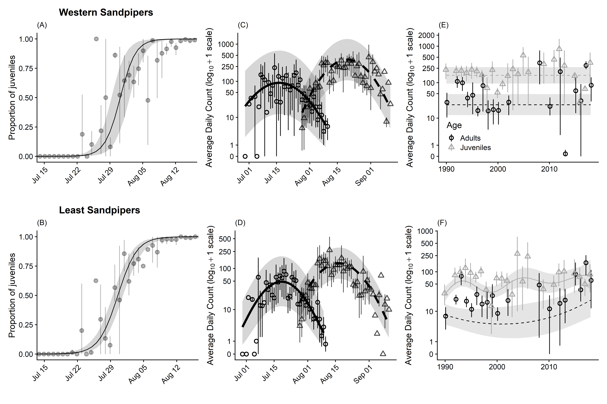
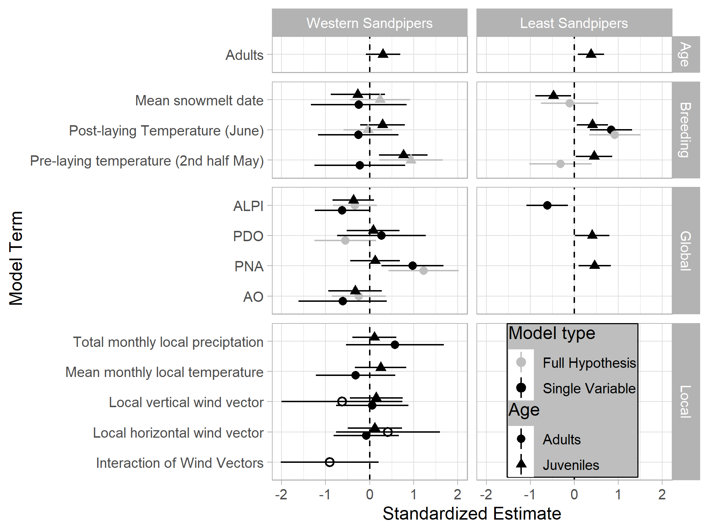
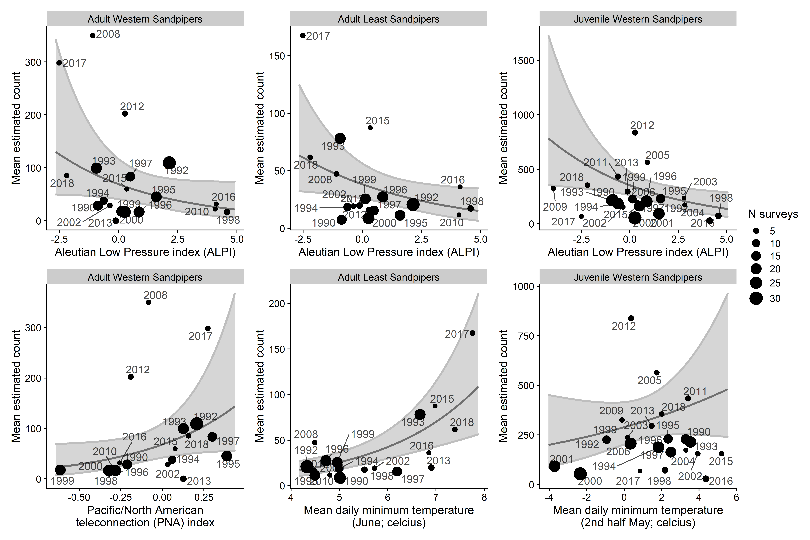
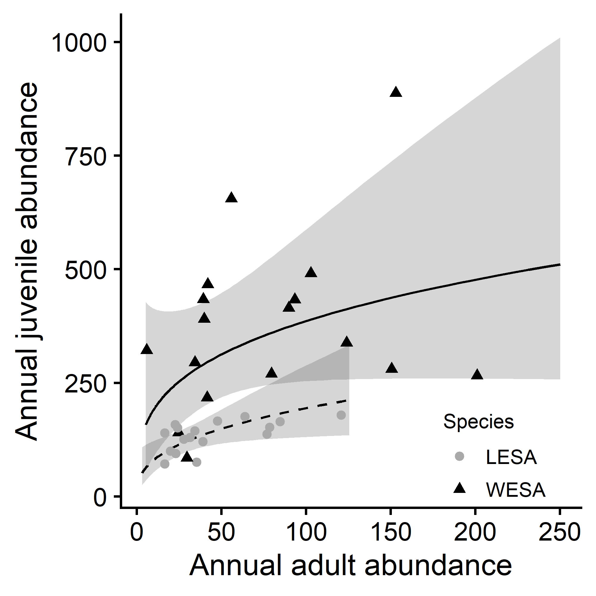

# Correlates of Annual Stopover Counts in Two Species of Arctic-Breeding Shorebirds: Roles of Local, Breeding, and Climactic Drivers
This package contains the code from the manuscript:

Correlates of Annual Stopover Counts in Two Species of Arctic-Breeding Shorebirds: Roles of Local, Breeding, and Climactic Drivers

David Hope, Anna Drake, Daniel Shervill1, Moira J. F. Lemon, and Mark C. Drever

Follow `SidneyIslandAnalysis_Guide.Rmd` to recreate the analysis.

## Figures

